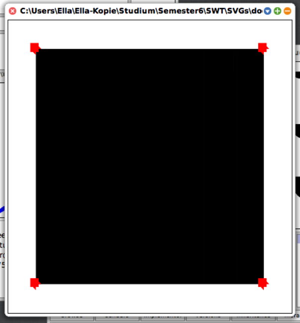

# SVGMorph
(swt20-18)
# Installation
First of all, you need download a Squeak Image from https://hpi.de/intern/studium/materialien.html?tx_dscfilebrowser_filebrowser%5Baction%5D=main&tx_dscfilebrowser_filebrowser%5Bcontroller%5D=Static&tx_dscfilebrowser_filebrowser%5Bfolder%5D=%2Fmaterialien%2FFG%20Software-Architekturen%2FSWT20_V%2FSqueak%2FNoEmpiricalStudy%2F&cHash=ad164fee13950c0211ab58777c9a5930 if you haven't yet(this assumes you are a HPI student or staff annd thus justified to access the  image). Decompress the image.
Once you are done with that,  you will need the Git Browser in the image to download the project(the following steps are copied from an E-mail by Patrick Rein and only minimally adapted by me to specifically refer to this project - I also removed some general hints that do not specifically apply to this project):
1. Open the Git Browser. Depending on your Squeak version, you can find it under Apps or under Tools. If this is the first time you open it, it might ask you, whether you want to add your first project now. You can decline for now, as we do not want to add a new project.
2. The pane at the top left pane is the list of projects which are currently managed through Squot. We will now add SVGMorph by opening the context menu of the list and selecting either "Clone Project" directly or "New project..." > "Clone Project".
3. A wizard opens which will guide us through the steps to clone SVGMorph.
4. First, it asks for an URL to clone from. We use the https URL of our repository, so in our case, that would be https://github.com/hpi-swa-teaching/SVGMorph.git). 
5. Second, we can enter a project name for SVGMorph which helps us remember our project(I recommend you just use "SVGMorph").
6. Third, we have to select a folder in which Squot can store a file-based version of the repository. You should create a dedicated folder for that even if you will not work with the working copy in the filesystem.
7. We have now provided all necessary details and Squot will go ahead and clone SVGMorph for us.
8. As soon as Squot finished cloning, we have the repository in the system but we do not yet have the objects loaded from the repository. For that to happen, we have to click on "Checkout objects" in the context menu on the topmost commit in the list of commits, which is the pane on the top right of the git browser.
9.  We are now presented with a list of changes to be loaded through the checkout. If you have no special requirements for loading the packages, you can simply click the "accept" button.
10. After a short loading time, the objects are now loaded in the system. If the repository stored packages, you can now start browsing your code - or just start using SVGMorph right away.

# Supported/Not Supported Features of SVG
(List of SVG Functionality/Features as defined by:https://en.wikipedia.org/wiki/Scalable_Vector_Graphics and  https://developer.mozilla.org/en-US/docs/Web/SVG/Tutorial)

Supported:
Scaling the opened SVGMOrphs via Halo.
Scaling the opened SVGMorphs via Halo.
SVG Rectangles, Circles, Ellipses, Lines, Polylines, Polygons and Paths(i.e SVG Basic Shapes).
SVG Fills and Strokes.
SVG Gradients.
SVG Patterns.
Every supported SVG Feature and its content is defined as according to: https://developer.mozilla.org/en-US/docs/Web/SVG/Tutorial

Not supported:
SVG Text
SVG Clipping,Masking and Compositing
SVG Filter effects
SVG Interactivity
SVG Linking 
SVG Scripting
SVG Animation
SVG Fonts
SVG Metadata

# Usage
There are three ways of using SVGMorph:
Using SVGMorph example:
Open the Squeak Workspace. Type the command "SVGMorph example" inside, mark it und and press Ctrl+D for "do it"on it. Then, a dialog will pop up that will allow you to choose a file from the file system. Choose the svg file you want to open in Squeak. Then click the "ok" option in the dialog(if you do not want to insert an image, click "cancel", also in the same dialog). If you chose "ok", the SVGMorph of your chosen picture just appeared in your Squeak image.
Using SVGMorph fromFile:
Open the Squeak Workspace. Find the absolute or relative Path to the file you want to open. Then type the command "(SVGMorph fromFile: 'absoluteOrRelativePathToFile') openInWorld" and then the morph will appear in your Squeak image.
Using SVGMorph fromstring:
Open the Squeak Workspace. Find a string that correctly describes an SVG object. Then type the command "(SVGMorph fromString: 'SVGObjectString') openInWorld" and then the morph will appear in your Squeak image.
# Known Issues
-sometimes TextMorphs, when reduced in size, do not shrink but disappear upward from the field of view
-when enlarging textMorph, size changes do not happen smoothly but rather sudden
-basic shapes are filled with black color from the stroke Attribute specification when they are specified to be transparent (only shapes with fill attributes are affected)
-cannot display bezier curves properly(they are displayed as filled-out split ellipses) - in contrast: arcs are mostly displayed well except for some full shapes that are filled with black - likely also because of previous problem
-when enlarging this image, the dots at the edges of the rectangle get deformed to cubes with spikes(source code without enlarging below the image):



```
-stroke-linejoin and stroke-linecap properties specified in the programs are not always adhered to
-path may wrongly have the same color as stroke(?)
-stroke-dasharray does not always create dashed lines on a stroke
-strokes and fills are not always properly manipulated using CSS
-gradients are only displayed as specified in rare cases(in the other other cases the shapes just have the color of the stop-color offset 0%)
-cannot display patterns because it does not recognize a pattern specification(it apppears to read it as a fill for some reason)
