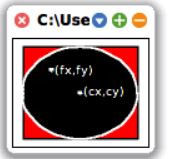

# SVGMorph
(swt20-18)

Implements the SVG Standard in the Squeak programming language.

# Installation
Install metacello-work in your Squeak-image if you have not done so already. In any case,  copy the following into your workspace to get started:
```
Metacello new
	baseline: 'SVGMorph';
	repository: 'github://hpi-swa-teaching/SVGMorph:master/packages';
	load
```

 Now you will be able to use SVGMorph in your Squeak image.
 
# Supported
(List of SVG Functionality/Features as defined by:https://en.wikipedia.org/wiki/Scalable_Vector_Graphics and  https://developer.mozilla.org/en-US/docs/Web/SVG/Tutorial)

Supported:
Scaling the opened SVGMOrphs via Halo.  

SVG Rectangles, Circles, Ellipses, Lines, Polylines, Polygons and Paths(i.e SVG Basic Shapes).

SVG Fills and Strokes.

SVG Gradients.

SVG Text

# Not Supported Features of SVG

SVG Patterns.


# Usage
There are three ways of using SVGMorph:

Using SVGMorph example:

Open the Squeak Workspace. Type the command "SVGMorph example" inside, mark it und and press Ctrl+D for "do it"on it. Then, a dialog will pop up that will allow you to choose a file from the file system. Choose the svg file you want to open in Squeak. Then click the "ok" option in the dialog(if you do not want to insert an image, click "cancel", also in the same dialog). If you chose "ok", the SVGMorph of your chosen picture just appeared in your Squeak image.

Using SVGMorph fromFile:

Open the Squeak Workspace. Find the absolute or relative Path to the file you want to open. Then type the command "(SVGMorph fromFile: 'absoluteOrRelativePathToFile') openInWorld" and then the morph will appear in your Squeak image.

Using SVGMorph fromstring:

Open the Squeak Workspace. Find a string that correctly describes an SVG object. Then type the command "(SVGMorph fromString: 'SVGObjectString') openInWorld" and then the morph will appear in your Squeak image.
# Known Issues
-sometimes TextMorphs, when reduced in size, do not shrink but disappear upward from the field of view

-basic shapes are filled with black color from the stroke Attribute specification when they are specified to be transparent (only shapes with fill attributes are affected)

-cannot display bezier curves properly(they are displayed as filled-out split ellipses) - in contrast: arcs are mostly displayed well except for some full shapes that are filled with black - likely also because of previous problem

-stroke-linejoin and stroke-linecap properties specified in the programs are not always adhered to(stroke-linecap only seems ot be displayed as "square" and stroke-linejoin has not the exact specified shape, the shape "bevel" comes closest). Following is a picture of it and then its SVG data:
 
```
<svg width="160" height="280" xmlns="http://www.w3.org/2000/svg" version="1.1">
  <polyline points="40 60 80 20 120 60" stroke="black" stroke-width="20"
      stroke-linecap="butt" fill="none" stroke-linejoin="miter"/>
  
  <polyline points="40 140 80 100 120 140" stroke="black" stroke-width="20"
      stroke-linecap="round" fill="none" stroke-linejoin="round"/>
  
  <polyline points="40 220 80 180 120 220" stroke="black" stroke-width="20"
      stroke-linecap="square" fill="none" stroke-linejoin="bevel"/>
</svg>
```
-path may wrongly have the same color as stroke

-stroke-dasharray does not always create dashed lines on a stroke

-gradients are only displayed as specified in rare cases(in the other other cases the shapes just have the color of the stop-color offset 0% and no other). Following are two examples with their SVG Code:


```
<svg width="120" height="240" version="1.1" xmlns="http://www.w3.org/2000/svg">
  <defs>
      <radialGradient id="RadialGradient1">
        <stop offset="0%" stop-color="red"/>
        <stop offset="100%" stop-color="blue"/>
      </radialGradient>
      <radialGradient id="RadialGradient2" cx="0.25" cy="0.25" r="0.25">
        <stop offset="0%" stop-color="red"/>
        <stop offset="100%" stop-color="blue"/>
      </radialGradient>
  </defs>
 
  <rect x="10" y="10" rx="15" ry="15" width="100" height="100" fill="url(#RadialGradient1)"/> 
  <rect x="10" y="120" rx="15" ry="15" width="100" height="100" fill="url(#RadialGradient2)"/> 
  
</svg>
```

```<svg width="120" height="120" version="1.1"
  xmlns="http://www.w3.org/2000/svg">
  <defs>
      <radialGradient id="Gradient"
            cx="0.5" cy="0.5" r="0.5" fx="0.25" fy="0.25">
        <stop offset="0%" stop-color="red"/>
        <stop offset="100%" stop-color="blue"/>
      </radialGradient>
  </defs>
 
  <rect x="10" y="10" rx="15" ry="15" width="100" height="100"
        fill="url(#Gradient)" stroke="black" stroke-width="2"/>

  <circle cx="60" cy="60" r="50" fill="transparent" stroke="white" stroke-width="2"/>
  <circle cx="35" cy="35" r="2" fill="white" stroke="white"/>
  <circle cx="60" cy="60" r="2" fill="white" stroke="white"/>
  <text x="38" y="40" fill="white" font-family="sans-serif" font-size="10pt">(fx,fy)</text>
  <text x="63" y="63" fill="white" font-family="sans-serif" font-size="10pt">(cx,cy)</text>
  
</svg>
```

-cannot display patterns because it does not recognize a pattern specification(it apppears to read it as a fill for some reason)-may be related to the other errors related to fill

-when enlarging this image, the dots at the edges of the rectangle get deformed to cubes with spikes(source code without enlarging below the image):


```
<svg width="100" height="100" xmlns="http://www.w3.org/2000/svg">
  
  <path d="M 10 10 H 90 V 90 H 10 L 10 10"/>
  <!-- Points -->
  <circle cx="10" cy="10" r="2" fill="red"/>
  <circle cx="90" cy="90" r="2" fill="red"/>
  <circle cx="90" cy="10" r="2" fill="red"/>
  <circle cx="10" cy="90" r="2" fill="red"/>
</svg> 
